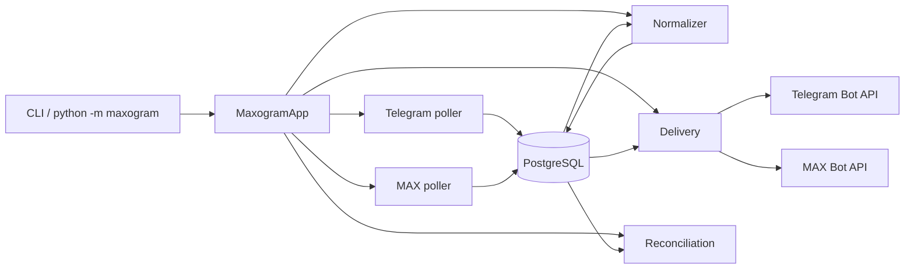

# Maxogram Architecture

## Project Overview

Maxogram is a single-process Python asyncio bridge that mirrors one Telegram chat to one MAX chat and back.

The repository currently implements:

- a small deployment model centered around one long-running Docker container
- PostgreSQL as the only durable store for bridge state, queues, mappings, and recovery data
- configuration loaded from environment variables in production and `tokens.py` as a local-development fallback
- Alembic-driven schema bootstrap and upgrades

This document describes the implementation that exists in the repository today.

## Runtime Architecture

### Entry Points

The repository exposes `python -m maxogram` from both the repository-root package and the `src/maxogram` package.

Implemented CLI commands:

- `python -m maxogram check-config`
- `python -m maxogram db-upgrade`
- `python -m maxogram run`

### Configuration Sources

Runtime settings are env-first:

- production installs typically provide `MAXOGRAM_*` variables through Docker Compose `env_file: /etc/maxogram/maxogram.env`
- local CLI runs can also point to a dotenv-style file through `MAXOGRAM_ENV_FILE` or a repository-local `.env`
- when no `MAXOGRAM_*` runtime config is present, the app falls back to local `tokens.py`

Required runtime settings:

- `MAXOGRAM_TG_BOT_TOKEN`
- `MAXOGRAM_MAX_BOT_TOKEN`
- `MAXOGRAM_DB_DATABASE`
- `MAXOGRAM_DB_USER`
- `MAXOGRAM_DB_PASSWORD`
- `MAXOGRAM_DB_HOST`
- `MAXOGRAM_DB_PORT`

Optional env settings:

- `MAXOGRAM_TEST_DB_DATABASE`
- `MAXOGRAM_TEST_DB_USER`
- `MAXOGRAM_TEST_DB_PASSWORD`
- `MAXOGRAM_TEST_DB_HOST`
- `MAXOGRAM_TEST_DB_PORT`
- `MAXOGRAM_VPS_HOST`
- `MAXOGRAM_VPS_SSH_PORT`

The `AppSettings` and `DatabaseConfig` shapes remain the same regardless of whether config came from env or `tokens.py`.

Installer-managed production deployment now works like this:

- `install.sh` can still install or reuse a local PostgreSQL instance and schema
- `install.sh` writes `/etc/maxogram/maxogram.env`
- `install.sh` writes `/opt/maxogram/docker-compose.app.yml`
- the public runtime artifact is `docker.io/d0ke/maxogram:latest`
- the long-running bridge process is supervised through Docker `restart: unless-stopped`

### Package Layout

Main runtime areas:

- `src/maxogram/app.py`: process bootstrap and worker supervision
- `src/maxogram/cli.py`: CLI entrypoints and Alembic wiring
- `src/maxogram/config.py`: env and `tokens.py` loading
- `src/maxogram/db`: SQLAlchemy models, async session management, repositories
- `src/maxogram/platforms`: Telegram and MAX client adapters
- `src/maxogram/services`: normalization, rendering, media planning, commands, formatting, retries
- `src/maxogram/workers`: pollers, normalizer, delivery, reconciliation
- `alembic`: baseline and incremental schema migrations

### Process Model

`MaxogramApp` starts one async SQLAlchemy engine and launches five worker loops:

- Telegram poller
- MAX poller
- normalizer
- delivery
- reconciliation

At startup the app ensures bootstrap rows exist for:

- `bot_credentials`
- `proxy_profiles`

It then creates the platform clients directly from loaded runtime settings.

### Runtime Flow

## Message Flow

### Polling and Inbox Persistence

Each poller reads its cursor from `platform_cursors`, fetches a batch of updates, writes deduplicated raw updates into `inbox_updates`, and advances the cursor in the same transaction.

Telegram polling:

- uses `getUpdates`
- requests `message`, `edited_message`, `chat_member`, and `my_chat_member`
- safely serializes update objects before writing them into PostgreSQL
- persists Telegram album members individually; grouping happens later in normalization rather than inside the poller

MAX polling:

- uses long polling with explicit update types
- uses `update_id` or a stable raw-update hash as the inbox dedup key
- persists multi-attachment messages as one raw update, which later lets normalization build one logical grouped event

### Normalization and Bridge Resolution

The normalizer claims `inbox_updates` rows with `FOR UPDATE SKIP LOCKED`, converts raw platform payloads into `NormalizedUpdate` objects, and decides whether each row becomes:

- a command reply
- a canonical relay event
- an ignored row

For grouped Telegram `photo/video` albums it first buffers member messages in `telegram_media_group_buffers` and `telegram_media_group_buffer_members`, keyed by `telegram:<chat_id>:<media_group_id>`, and flushes them after a short quiet window so one album becomes one canonical chunk event.

For relayable messages it resolves:

- the bridge and destination chat
- sender identity and alias
- reply mapping when available
- rendered text, HTML text, fallback text, and media metadata
- grouped-media metadata such as `group_kind`, stable `group_key`, ordered `media_items`, and source member ids when a payload represents a logical chunk

MAX messages that contain multiple supported `image` or `video` attachments normalize into one logical `photo_video_chunk` event with chunk-scoped caption handling instead of multiple unrelated relay events.

It then inserts a deduplicated row into `canonical_events` and enqueues work in `outbox_tasks` or `pending_mutations`.

### Delivery and Mapping

The delivery worker claims `outbox_tasks`, performs network I/O outside the original claim transaction, and finalizes success or failure in a fresh transaction.

Successful sends always persist the actual emitted destination shape. For ordinary messages this means a `message_mappings` row. For grouped `photo/video` chunks it can also mean:

- a `message_chunks` row for the logical source-to-destination chunk
- `message_chunk_members` rows for ordered source and destination member ids
- enriched `outbox_tasks.task` JSON that records `dst_message_id`, optional `dst_message_ids`, and a `delivery_state` snapshot used by later edit/delete classification

When a grouped payload is too large for one downstream request, delivery can split it into multiple ordered destination messages and, on `MAX -> Telegram`, emit bracketed oversize hint stubs for filtered items.

These mappings later power:

- native reply targets
- edit mirroring
- delete mirroring

### Reconciliation

The reconciliation worker:

- resets expired in-flight outbox rows
- replays `pending_mutations` after the needed mappings appear
- expires unrecoverable pending mutations into `dead_letters`
- prunes converted animated-sticker GIF cache entries not used for more than 90 days

## Database Architecture

### Storage Model

PostgreSQL is the only durable store. There is no external queue, cache, or broker.

The repository currently has two Alembic revisions:

- `20260410_0001`: baseline schema bootstrap whose `upgrade()` calls `Base.metadata.create_all(...)` and whose `downgrade()` calls `Base.metadata.drop_all(...)`
- `20260419_0002`: incremental migration that adds persistent Telegram media-group buffering tables plus logical chunk/member mapping tables for grouped photo/video sync

The live schema therefore includes both the baseline relay tables and the grouped-media persistence tables when a database is upgraded to head.

The installer can place tables in a non-public PostgreSQL schema by:

- creating the chosen schema
- setting the Maxogram role `search_path`

The SQLAlchemy models themselves remain schema-unqualified, so the search path is what controls the effective schema at runtime.

### Table Reference

#### `tenants`

Purpose: logical grouping for a bridge. The current runtime creates one tenant per confirmed bridge.

Columns:

- `tenant_id`: UUID primary key for the tenant.
- `display_name`: tenant label. The current runtime uses a default display name during link confirmation.
- `created_at`: server-generated creation timestamp.

#### `bot_credentials`

Purpose: per-platform bootstrap metadata about the Telegram and MAX bot identities known to the database.

Columns:

- `bot_id`: UUID primary key for the bot record.
- `platform`: enum value, either `telegram` or `max`.
- `token_ciphertext`: encrypted-token placeholder column. The live runtime still reads real tokens from env or `tokens.py`.
- `token_kid`: token key identifier. Defaults to `local-file`.
- `bot_user_id`: optional platform-specific bot account id.
- `is_active`: whether the bot credential row is active.
- `created_at`: server-generated creation timestamp.

Notes:

- unique constraint on `platform`
- startup ensures one row exists per platform

#### `proxy_profiles`

Purpose: database-backed proxy settings per platform.

Columns:

- `platform`: enum primary key for the platform.
- `proxy_url`: optional proxy URL.
- `trust_env`: whether platform clients should trust ambient proxy environment variables.
- `updated_at`: last update timestamp.

Notes:

- the schema and clients support proxy settings
- current startup does not apply DB proxy settings to the live clients yet

#### `bridges`

Purpose: top-level bridge object tying a tenant to a bridge lifecycle state.

Columns:

- `bridge_id`: UUID primary key for the bridge.
- `tenant_id`: foreign key to `tenants.tenant_id`.
- `status`: enum bridge status, currently `active`, `paused`, or `deleted`.
- `created_at`: creation timestamp.
- `updated_at`: last update timestamp.

Notes:

- chat identities for the two ends of the bridge live in `bridge_chats`

#### `bridge_chats`

Purpose: map each bridge to its concrete Telegram and MAX chat ids.

Columns:

- `bridge_id`: foreign key to `bridges.bridge_id`.
- `platform`: enum primary-key component identifying Telegram or MAX.
- `chat_id`: platform chat id stored as text.

Notes:

- composite primary key on `(bridge_id, platform)`
- unique constraint on `(platform, chat_id)` so one chat cannot belong to multiple bridges
- indexed by `(platform, chat_id)` for bridge resolution during normalization

#### `bridge_admins`

Purpose: snapshot bridge admin or owner identities recorded during bridge confirmation.

Columns:

- `bridge_id`: foreign key to `bridges.bridge_id`.
- `platform`: enum primary-key component.
- `platform_user_id`: platform user id for the admin.
- `role`: text role, constrained to `admin` or `owner`.
- `created_at`: creation timestamp.

Notes:

- current admin checks still call platform APIs directly
- stored rows are durable audit/bootstrap data

#### `platform_identities`

Purpose: cached user metadata seen while processing messages.

Columns:

- `platform`: enum primary-key component.
- `user_id`: platform user id primary-key component.
- `username`: optional username.
- `first_name`: optional first name.
- `last_name`: optional last name.
- `is_bot`: optional bot flag.
- `updated_at`: last refresh timestamp.

Notes:

- upserted during normalization when sender identity is available

#### `aliases`

Purpose: bridge-scoped alias overrides for specific users on a specific platform.

Columns:

- `bridge_id`: foreign key to `bridges.bridge_id`.
- `platform`: enum primary-key component.
- `user_id`: platform user id primary-key component.
- `alias`: rendered display alias for mirrored messages.
- `set_by_user_id`: platform user id that last set the alias.
- `is_admin_override`: whether the alias was set by an admin override flow.
- `updated_at`: last update timestamp.

Notes:

- this is the active alias table used by the runtime today

#### `alias_audit`

Purpose: history of alias changes.

Columns:

- `audit_id`: UUID primary key for the audit row.
- `bridge_id`: bridge id referenced by the change.
- `platform`: platform where the alias belongs.
- `user_id`: affected user id.
- `old_alias`: previous alias value, if any.
- `new_alias`: new alias value, if any.
- `set_by_user_id`: actor that changed the alias.
- `changed_at`: timestamp of the change.

#### `platform_cursors`

Purpose: last committed polling cursor per bot and platform.

Columns:

- `platform`: enum primary-key component.
- `bot_id`: foreign key to `bot_credentials.bot_id`.
- `cursor_value`: numeric cursor/offset value.
- `updated_at`: last cursor update timestamp.

Notes:

- pollers use this table to resume after restarts

#### `inbox_updates`

Purpose: deduplicated raw inbound platform updates.

Columns:

- `inbox_id`: UUID primary key for the raw update row.
- `platform`: source platform enum.
- `bot_id`: foreign key to `bot_credentials.bot_id`.
- `update_key`: deduplication key built from the raw update.
- `raw`: JSONB payload storing the raw update.
- `status`: row status enum such as `new`, `processed`, or `ignored`.
- `received_at`: ingestion timestamp.

Notes:

- unique constraint on `(platform, bot_id, update_key)`
- indexed by `(status, received_at)` for worker claims

#### `telegram_media_group_buffers`

Purpose: durable short-lived buffer state for Telegram media groups that need to be aggregated into one logical chunk before canonicalization.

Columns:

- `buffer_id`: UUID primary key for the open buffer row.
- `group_key`: stable logical group key, currently `telegram:<chat_id>:<media_group_id>`.
- `chat_id`: Telegram chat id for the album.
- `media_group_id`: raw Telegram media-group identifier.
- `anchor_message_id`: optional anchor message id for the buffered album.
- `pending_flush`: whether the buffer is still waiting to be flushed by the normalizer.
- `has_flushed`: whether the buffer has already been converted into a canonical chunk event.
- `flush_after`: timestamp after which the normalizer may flush the group.
- `created_at`: creation timestamp.
- `updated_at`: last update timestamp.

Notes:

- unique constraint on `group_key`
- indexed by `(pending_flush, flush_after)` so the normalizer can claim ready groups efficiently

#### `telegram_media_group_buffer_members`

Purpose: ordered raw Telegram album members attached to one open media-group buffer.

Columns:

- `buffer_member_id`: UUID primary key.
- `buffer_id`: foreign key to `telegram_media_group_buffers.buffer_id`.
- `message_id`: Telegram message id for the buffered member.
- `position`: current member position inside the buffered group.
- `raw_message`: JSONB raw Telegram message payload for the member.
- `created_at`: creation timestamp.
- `updated_at`: last update timestamp.

Notes:

- unique constraint on `(buffer_id, message_id)`
- unique constraint on `(buffer_id, position)`
- indexed by `(buffer_id, position)` for ordered flush reads
- repository logic resequences members into canonical message-id order before flush

#### `canonical_events`

Purpose: normalized source-of-truth relay events derived from raw inbox updates.

Columns:

- `event_id`: UUID primary key for the canonical event.
- `bridge_id`: foreign key to `bridges.bridge_id`.
- `dedup_key`: unique deduplication key for the normalized event.
- `src_platform`: source platform enum.
- `src_chat_id`: source chat id.
- `src_user_id`: optional source user id.
- `src_message_id`: optional source message id.
- `type`: runtime event type such as create, edit, delete, or service.
- `happened_at`: source event timestamp.
- `payload`: JSONB runtime payload used by delivery logic.
- `raw_inbox_id`: optional foreign key back to `inbox_updates.inbox_id`.
- `created_at`: server-generated creation timestamp.

Notes:

- unique constraint on `dedup_key`
- indexed by `(bridge_id, created_at)`

#### `message_mappings`

Purpose: durable source-to-destination message id mapping for mirrored messages.

Columns:

- `mapping_id`: UUID primary key for the mapping row.
- `bridge_id`: foreign key to `bridges.bridge_id`.
- `src_platform`: source platform enum.
- `src_chat_id`: source chat id.
- `src_message_id`: source message id.
- `dst_platform`: destination platform enum.
- `dst_chat_id`: destination chat id.
- `dst_message_id`: destination message id.
- `created_at`: mapping creation timestamp.

Notes:

- unique constraint for the source side of a mapping
- unique constraint for the destination side of a mapping
- used for replies, edits, deletes, and replay of pending mutations

#### `message_chunks`

Purpose: logical mapping for grouped relay events where one normalized chunk may correspond to multiple source or destination member message ids.

Columns:

- `chunk_id`: UUID primary key for the logical chunk row.
- `bridge_id`: foreign key to `bridges.bridge_id`.
- `group_kind`: logical chunk type, currently used for grouped `photo/video` relay.
- `src_platform`: source platform enum.
- `src_chat_id`: source chat id.
- `src_message_id`: logical source message id for the chunk.
- `dst_platform`: destination platform enum.
- `dst_chat_id`: destination chat id.
- `dst_message_id`: primary destination message id for the chunk.
- `created_at`: creation timestamp.
- `updated_at`: last update timestamp.

Notes:

- unique constraint on `(bridge_id, src_platform, src_chat_id, src_message_id)`
- indexed for both source-side and destination-side chunk lookup
- complements `message_mappings` when the runtime needs one logical grouped mapping plus ordered member lookups

#### `message_chunk_members`

Purpose: ordered source-side and destination-side member ids that belong to a logical chunk mapping.

Columns:

- `chunk_member_id`: UUID primary key.
- `chunk_id`: foreign key to `message_chunks.chunk_id`.
- `bridge_id`: foreign key to `bridges.bridge_id`.
- `member_role`: constrained text value, either `src` or `dst`.
- `platform`: platform enum for the stored member id.
- `chat_id`: chat id for the stored member id.
- `message_id`: concrete member message id.
- `position`: ordered position within the logical chunk.
- `created_at`: creation timestamp.
- `updated_at`: last update timestamp.

Notes:

- check constraint limiting `member_role` to `src` or `dst`
- unique constraint on `(chunk_id, member_role, position)`
- unique constraint on `(bridge_id, platform, chat_id, message_id)` for reverse lookup by any chunk member
- indexed by `(bridge_id, platform, chat_id, message_id)` for reply/edit/delete resolution

#### `pending_mutations`

Purpose: deferred edit/delete events that arrived before the source message had a destination mapping.

Columns:

- `pending_id`: UUID primary key for the deferred mutation.
- `bridge_id`: foreign key to `bridges.bridge_id`.
- `dedup_key`: unique mutation deduplication key.
- `src_platform`: source platform enum.
- `src_chat_id`: source chat id.
- `src_message_id`: source message id.
- `mutation_type`: constrained text value, currently `edit` or `delete`.
- `payload`: JSONB mutation payload.
- `status`: task status enum. Pending mutations currently use retry-oriented statuses.
- `next_attempt_at`: next reconciliation attempt timestamp.
- `expires_at`: hard expiry timestamp.
- `created_at`: creation timestamp.

Notes:

- unique constraint on `dedup_key`
- indexed by `(status, next_attempt_at)`

#### `outbox_tasks`

Purpose: ordered durable delivery queue for sends, edits, and deletes.

Columns:

- `outbox_id`: UUID primary key for the task.
- `bridge_id`: foreign key to `bridges.bridge_id`.
- `dedup_key`: unique deduplication key for the destination action.
- `src_event_id`: foreign key to `canonical_events.event_id`.
- `dst_platform`: destination platform enum.
- `action`: constrained text value, currently `send`, `edit`, or `delete`.
- `partition_key`: ordering partition, typically bridge plus direction.
- `seq`: monotonic sequence number within the partition.
- `task`: JSONB delivery payload.
- `status`: task status enum such as `ready`, `inflight`, `retry_wait`, `done`, or `dead`.
- `attempt_count`: number of delivery attempts so far.
- `next_attempt_at`: next time the task is eligible to run.
- `inflight_until`: lease-expiry timestamp for long-running deliveries.
- `created_at`: creation timestamp.

Notes:

- unique constraint on `dedup_key`
- unique constraint on `(partition_key, seq)`
- indexed for ready-task lookup and ordered partition scans
- successful sends may persist `dst_message_id`, ordered `dst_message_ids`, and a `delivery_state` snapshot back into `task` JSON so later mutations can see the actual emitted delivery shape

#### `delivery_attempts`

Purpose: delivery-attempt history for each outbox row.

Columns:

- `attempt_id`: UUID primary key.
- `outbox_id`: foreign key to `outbox_tasks.outbox_id`.
- `attempt_no`: per-task attempt number.
- `started_at`: attempt start timestamp.
- `finished_at`: optional completion timestamp.
- `outcome`: text outcome value.
- `http_status`: optional downstream HTTP status.
- `error_code`: optional platform error code.
- `error_message`: optional error detail.

Notes:

- unique constraint on `(outbox_id, attempt_no)`

#### `dead_letters`

Purpose: terminal-failure archive for unrecoverable outbox or mutation work.

Columns:

- `dlq_id`: UUID primary key.
- `bridge_id`: related bridge id.
- `outbox_id`: optional related outbox row id.
- `reason`: terminal-failure reason.
- `payload`: JSONB dead-letter payload snapshot.
- `created_at`: creation timestamp.

#### `command_log`

Purpose: audit table for bridge and alias commands processed by the bot.

Columns:

- `cmd_id`: UUID primary key.
- `platform`: platform enum where the command was received.
- `chat_id`: source chat id.
- `message_id`: optional source message id.
- `user_id`: issuing user id.
- `bridge_id`: optional bridge id connected to the command.
- `command`: command name.
- `args`: optional raw argument string.
- `created_at`: execution timestamp.

Notes:

- unique constraint on `(platform, chat_id, message_id)`

#### `media_objects`

Purpose: reserved table for durable media cache metadata.

Columns:

- `media_id`: UUID primary key.
- `bridge_id`: optional related bridge id.
- `src_platform`: optional source platform enum.
- `src_message_id`: optional source message id.
- `content_hash`: optional content hash.
- `mime_type`: optional mime type.
- `byte_size`: optional content size.
- `local_path`: optional local cache path.
- `expires_at`: expiry timestamp.
- `created_at`: creation timestamp.

Notes:

- the live runtime currently uses transient files under `temp/media_cache` plus a container-local animated sticker GIF cache under `temp/animated_sticker_cache` instead of persisting media metadata here

#### `link_codes`

Purpose: short-lived bridge confirmation codes used by `/bridge link` and `/bridge confirm`.

Columns:

- `link_code_id`: UUID primary key.
- `code`: unique short confirmation code.
- `src_platform`: platform where the code was created.
- `src_chat_id`: source chat id that requested the code.
- `src_user_id`: requesting user id.
- `expires_at`: code expiry timestamp.
- `consumed_at`: optional consumption timestamp.
- `created_at`: creation timestamp.

Notes:

- unique constraint on `code`
- indexed by `(code, expires_at)` for confirmation lookups

## Persistence Conventions

The queueing and deduplication model relies on concrete database conventions:

- `inbox_updates` deduplicates raw updates by `(platform, bot_id, update_key)`
- `telegram_media_group_buffers` hold open Telegram albums until a quiet-window flush creates one canonical chunk event
- `canonical_events` deduplicates normalized events by `dedup_key`
- `outbox_tasks` deduplicates destination actions by `dedup_key`
- `message_mappings` supports lookups from both source ids and destination ids
- `message_chunks` and `message_chunk_members` map logical grouped messages to their ordered source and destination member ids
- `pending_mutations` holds edits and deletes until mappings exist
- successful `outbox_tasks.task` payloads may record `delivery_state` plus emitted destination ids for later mutation decisions

Outbox ordering is enforced by:

- `partition_key`
- monotonic `seq`
- repository logic that serializes sequence allocation per partition

## Supported Bridge Behavior

### Text, Replies, and Commands

Current bridge behavior includes:

- alias-prefixed mirrored messages
- fallback reply hints when native mapping is missing
- bridge lifecycle commands
- alias management commands
- DLQ inspection command support

### Formatting

Supported Telegram formatting:

- bold
- italic
- underline
- strikethrough
- code
- pre
- text links
- literal URL entities

Supported MAX formatting:

- strong
- emphasized
- underline
- strikethrough
- monospaced
- link

Unsupported markup degrades to plain text instead of crashing normalization.

### Media

Telegram-origin media currently supports:

- photos
- GIF and MP4 animations
- videos
- documents
- audio
- voice
- animated stickers as `.tgs -> GIF -> MAX image`
- static stickers as images
- video stickers as videos

MAX-origin media currently supports:

- images
- GIF-like images promoted to animations when detected
- videos
- files
- audio
- stickers as images

Grouped photo/video chunk behavior currently includes:

- Telegram albums are aggregated into one logical `photo_video_chunk` event before delivery
- `Telegram -> MAX` grouped sends and edits use one MAX message with the full ordered attachment array
- `MAX -> Telegram` grouped sends use native Telegram media groups, can split oversized chunks into multiple ordered destination messages, keep the caption on the first emitted media piece, and add bracketed oversize hint stubs when individual items are filtered out

### Edits and Deletes

Implemented mutation behavior:

- Telegram edited messages become distinct edit events
- MAX edited messages become distinct edit events
- MAX top-level `message_removed` updates become delete events
- edits and deletes replay later if they arrived before a destination mapping existed
- grouped deletes use chunk/member mappings so the runtime can remove the whole mirrored chunk rather than only one member
- grouped `MAX -> Telegram` edits use an in-place caption edit only for the narrow safe case where the mirrored Telegram delivery was a single-piece album with matching media identities; other grouped edits fall back to delete-and-recreate
- single-media text fallbacks and split grouped deliveries are classified from persisted `delivery_state` snapshots before later edits are applied

Known limitation:

- ordinary Telegram chat-history deletes are still not broadly observable to bots in the current polling model, so `Telegram -> MAX` delete sync remains incomplete

## Reliability Model

The runtime is at-least-once around the network edges with heavy deduplication around the database boundaries.

Important mechanisms:

- unique constraints at inbox, canonical-event, outbox, and mapping layers
- `FOR UPDATE SKIP LOCKED` worker claims
- outbox partition ordering
- in-flight lease extension for slow deliveries
- dead-lettering for terminal failures

Current retry policy:

- sends retry up to 10 attempts
- edits and deletes retry up to 6 attempts
- exponential backoff starts at 2 seconds and caps at 15 minutes

## Known Gaps

- `proxy_profiles` exist but are not yet applied to live clients at startup
- `media_objects` are not yet used by the runtime media flow
- metrics are collected in code but not exported over HTTP
- `bot_credentials.token_ciphertext` is placeholder metadata; real secrets still come from env or `tokens.py`
- `bridge_admins` are stored but not yet consulted as the primary admin-authorization source
